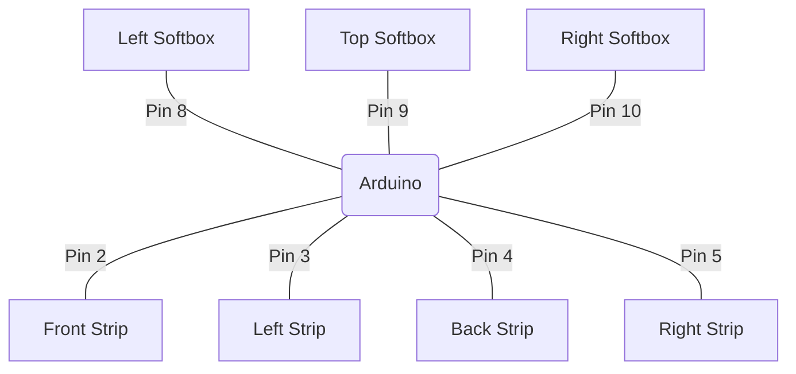
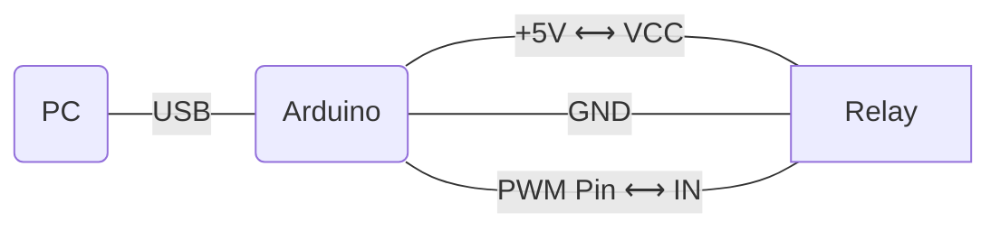
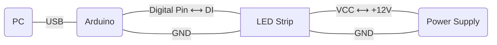
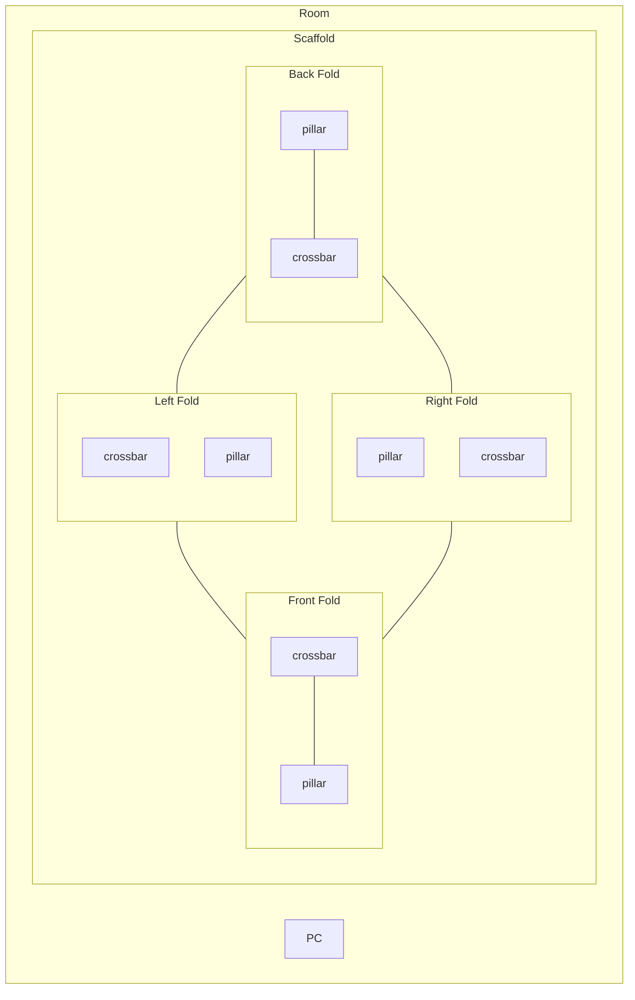

# Architecture

## Components

* _Softbox_ is an electrical unit controlled by a relay.
* _Strip_ is an electrical unit consisting of LEDs.
* _Range_ is a controllable segment of LED units on the strip.
* _Fold_ is a physical unit consisting of pillar and crossbar ranges covered by the strip folder.
* _Scaffold_ is a physical construction of pillars and crossbars as edges that make up faces.

!!! Note
    Adjacent faces share the same pillar.

## Connections

### Controller

All pins are digital, but to control a relay one need PWM (pulse-width modulating) pin.

### Softbox

Actually, softbox is controlled by relay connected as follows

### LED Strip

On the left end of the LED strip there are 4 inputs: `VCC`, `GND` x2, and `DI`.
Its are connected as follows

## Floor Plan

